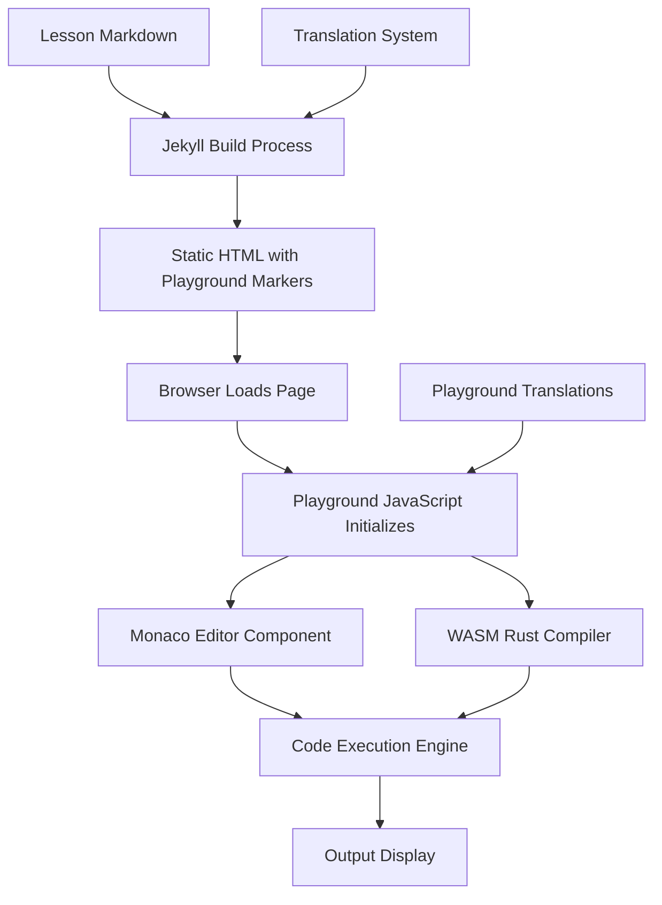

# Design Document

## Overview

The Interactive Code Playground feature will integrate a browser-based Rust code execution environment into the existing multilingual Jekyll tutorial site. The solution will use WebAssembly (WASM) to run Rust code directly in the browser, providing immediate feedback without requiring server-side infrastructure. This approach maintains compatibility with GitHub Pages hosting while delivering a rich interactive learning experience.

The playground will be implemented as a client-side JavaScript component that can be embedded in lessons through simple markdown syntax, leveraging the existing Jekyll build process and multilingual architecture.

## Architecture

### High-Level Architecture



### Component Architecture

The playground consists of four main components:

1. **Jekyll Integration Layer** - Processes markdown and generates playground HTML
2. **Frontend UI Components** - Monaco editor, output panel, controls
3. **Execution Engine** - WASM-based Rust compiler and runtime
4. **Multilingual Support** - Translation integration and language-aware features

### Technology Stack

- **Frontend Framework**: Vanilla JavaScript (maintaining site's minimal approach)
- **Code Editor**: Monaco Editor (VS Code's editor component)
- **Rust Compilation**: rust-playground WASM or similar WebAssembly solution
- **Build Integration**: Jekyll liquid templates and includes
- **Styling**: CSS integration with existing glassmorphism theme

## Components and Interfaces

### 1. Jekyll Integration Component

**Purpose**: Processes lesson markdown files and generates playground-enabled HTML

**Key Files**:
- `_includes/playground.html` - Liquid template for playground HTML structure
- `_plugins/playground_processor.rb` - Jekyll plugin to process playground markdown syntax
- `assets/js/playground-init.js` - Initialization script

**Markdown Syntax**:
```markdown
```rust playground
fn main() {
    println!("Hello, world!");
}
```
```

**Generated HTML Structure**:
```html
<div class="rust-playground" data-playground-id="unique-id">
    <div class="playground-toolbar">
        <button class="run-button">{{ site.data.translations[page.lang].playground.run }}</button>
        <button class="reset-button">{{ site.data.translations[page.lang].playground.reset }}</button>
        <button class="share-button">{{ site.data.translations[page.lang].playground.share }}</button>
    </div>
    <div class="playground-editor" data-initial-code="..."></div>
    <div class="playground-output"></div>
</div>
```

### 2. Frontend UI Components

**Monaco Editor Integration**:
```javascript
class PlaygroundEditor {
    constructor(container, initialCode, options) {
        this.editor = monaco.editor.create(container, {
            value: initialCode,
            language: 'rust',
            theme: 'playground-theme',
            minimap: { enabled: false },
            scrollBeyondLastLine: false,
            fontSize: 14,
            lineNumbers: 'on',
            automaticLayout: true
        });
    }
    
    getValue() { return this.editor.getValue(); }
    setValue(code) { this.editor.setValue(code); }
    onDidChangeModelContent(callback) { this.editor.onDidChangeModelContent(callback); }
}
```

**Output Panel Component**:
```javascript
class OutputPanel {
    constructor(container) {
        this.container = container;
        this.setupEventListeners();
    }
    
    displayOutput(result) {
        if (result.success) {
            this.showSuccess(result.stdout, result.stderr);
        } else {
            this.showError(result.error, result.stderr);
        }
    }
    
    showLoading() { /* Show spinner */ }
    clear() { /* Clear output */ }
}
```

### 3. Execution Engine

**WASM Rust Compiler Interface**:
```javascript
class RustExecutor {
    constructor() {
        this.wasmModule = null;
        this.initialized = false;
    }
    
    async initialize() {
        this.wasmModule = await import('./rust-playground.wasm');
        this.initialized = true;
    }
    
    async executeCode(code, timeout = 10000) {
        if (!this.initialized) await this.initialize();
        
        return new Promise((resolve, reject) => {
            const timer = setTimeout(() => {
                reject(new Error('Execution timeout'));
            }, timeout);
            
            try {
                const result = this.wasmModule.compile_and_run(code);
                clearTimeout(timer);
                resolve(result);
            } catch (error) {
                clearTimeout(timer);
                reject(error);
            }
        });
    }
}
```

### 4. Playground Controller

**Main Playground Class**:
```javascript
class RustPlayground {
    constructor(container, options = {}) {
        this.container = container;
        this.options = { ...this.defaultOptions, ...options };
        this.editor = null;
        this.output = null;
        this.executor = null;
        this.translations = null;
        
        this.initialize();
    }
    
    async initialize() {
        this.loadTranslations();
        this.setupUI();
        this.setupEventListeners();
        this.executor = new RustExecutor();
    }
    
    async runCode() {
        const code = this.editor.getValue();
        this.output.showLoading();
        
        try {
            const result = await this.executor.executeCode(code);
            this.output.displayOutput(result);
        } catch (error) {
            this.output.showError(error.message);
        }
    }
    
    resetCode() {
        this.editor.setValue(this.options.initialCode);
        this.output.clear();
    }
    
    shareCode() {
        const code = this.editor.getValue();
        const encoded = btoa(encodeURIComponent(code));
        const url = `${window.location.origin}${window.location.pathname}?code=${encoded}`;
        navigator.clipboard.writeText(url);
        this.showNotification(this.translations.playground.copied);
    }
}
```

## Data Models

### Playground Configuration

```javascript
const PlaygroundConfig = {
    // Editor settings
    editor: {
        theme: 'playground-theme',
        fontSize: 14,
        tabSize: 4,
        wordWrap: 'on',
        minimap: false,
        lineNumbers: true
    },
    
    // Execution settings
    execution: {
        timeout: 10000, // 10 seconds
        memoryLimit: '64MB',
        allowedCrates: ['std', 'serde', 'tokio'] // Predefined allowed crates
    },
    
    // UI settings
    ui: {
        showLineNumbers: true,
        showToolbar: true,
        collapsibleOutput: true,
        mobileOptimized: true
    }
};
```

### Execution Result Model

```javascript
const ExecutionResult = {
    success: boolean,
    stdout: string,
    stderr: string,
    compilationTime: number,
    executionTime: number,
    error: string | null,
    exitCode: number
};
```

### Translation Model Extension

```yaml
# Addition to _data/translations.yml
playground:
  run: "Run Code"
  reset: "Reset"
  share: "Share"
  copy: "Copy"
  copied: "Link copied to clipboard!"
  running: "Running..."
  timeout: "Code execution timed out"
  error: "Compilation Error"
  output: "Output"
  no_output: "No output"
  mobile_run: "▶"
  mobile_reset: "↺"
```

## Error Handling

### Compilation Errors

```javascript
class ErrorHandler {
    static formatCompilationError(error) {
        return {
            type: 'compilation',
            message: error.message,
            line: error.line || null,
            column: error.column || null,
            suggestion: error.suggestion || null
        };
    }
    
    static formatRuntimeError(error) {
        return {
            type: 'runtime',
            message: error.message,
            backtrace: error.backtrace || null
        };
    }
    
    static handleTimeout() {
        return {
            type: 'timeout',
            message: 'Code execution exceeded time limit (10 seconds)'
        };
    }
}
```

### Graceful Degradation

```javascript
class FallbackHandler {
    static checkWasmSupport() {
        return typeof WebAssembly === 'object' && 
               typeof WebAssembly.instantiate === 'function';
    }
    
    static showFallbackMessage(container, translations) {
        container.innerHTML = `
            <div class="playground-fallback">
                <p>${translations.playground.fallback_message}</p>
                <pre><code class="language-rust">${container.dataset.initialCode}</code></pre>
            </div>
        `;
    }
}
```

## Testing Strategy

### Unit Testing

**JavaScript Components**:
- Monaco Editor integration tests
- Execution engine tests with mock WASM module
- Output formatting and error handling tests
- Translation loading and switching tests

**Jekyll Integration**:
- Markdown processing tests
- Template rendering tests
- Multi-language output verification

### Integration Testing

**Browser Compatibility**:
- Cross-browser WASM support testing
- Mobile device responsive design testing
- Performance testing on low-end devices

**End-to-End Testing**:
- Complete playground workflow testing
- Language switching with playground state preservation
- Share functionality testing
- Offline functionality testing

### Performance Testing

**Metrics to Monitor**:
- Initial page load impact (< 2MB additional assets)
- Code execution time (< 5 seconds for simple programs)
- Memory usage (< 100MB peak)
- Mobile device performance

**Testing Approach**:
```javascript
// Performance monitoring
class PerformanceMonitor {
    static measureExecutionTime(fn) {
        const start = performance.now();
        const result = fn();
        const end = performance.now();
        return { result, time: end - start };
    }
    
    static measureMemoryUsage() {
        if (performance.memory) {
            return {
                used: performance.memory.usedJSHeapSize,
                total: performance.memory.totalJSHeapSize,
                limit: performance.memory.jsHeapSizeLimit
            };
        }
        return null;
    }
}
```

### Accessibility Testing

**Requirements**:
- Keyboard navigation support
- Screen reader compatibility
- High contrast mode support
- Focus management for dynamic content

**Implementation**:
```javascript
class AccessibilityManager {
    static setupKeyboardNavigation(playground) {
        playground.container.addEventListener('keydown', (e) => {
            if (e.ctrlKey || e.metaKey) {
                switch (e.key) {
                    case 'Enter':
                        e.preventDefault();
                        playground.runCode();
                        break;
                    case 'r':
                        e.preventDefault();
                        playground.resetCode();
                        break;
                }
            }
        });
    }
    
    static announceToScreenReader(message) {
        const announcement = document.createElement('div');
        announcement.setAttribute('aria-live', 'polite');
        announcement.setAttribute('aria-atomic', 'true');
        announcement.className = 'sr-only';
        announcement.textContent = message;
        document.body.appendChild(announcement);
        setTimeout(() => document.body.removeChild(announcement), 1000);
    }
}
```

This design provides a comprehensive foundation for implementing the interactive code playground while maintaining the site's existing architecture, performance characteristics, and multilingual support.